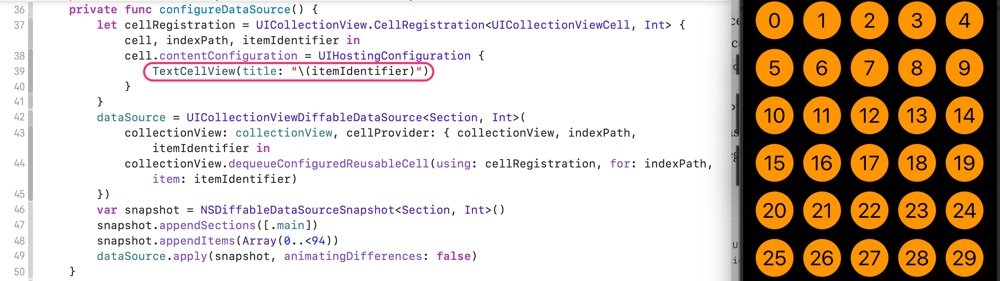

#  Layout

[Implementing Modern Collection Views](https://developer.apple.com/documentation/appkit/views_and_controls/collection_view/implementing_modern_collection_views/)

[Build an iOS 16 UICollectionView With a SwiftUI View as the Cell](https://betterprogramming.pub/build-a-uicollectionview-with-a-swiftui-view-as-its-cell-7a7121e84309)
